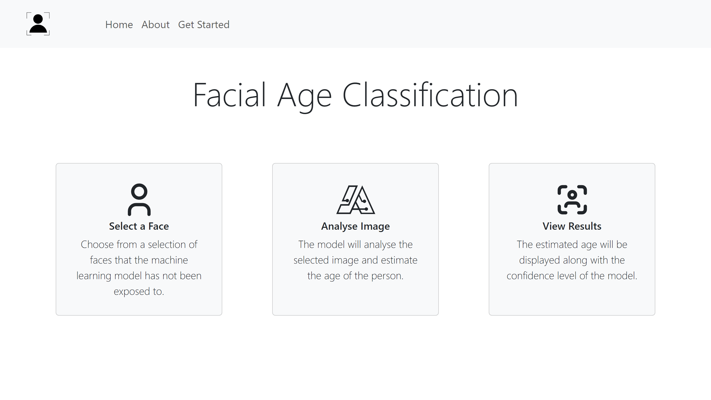

<br/>
<p align="center">
  <a href="https://github.com/c-young02/Age-classification">
    
  </a>

  <h3 align="center">Age Classification</h3>

  <p align="center">
    <a href="https://github.com/c-young02/Age-classification"><strong>Explore the docs »</strong></a>
    <br/>
    <br/>
    <a href="https://github.com/c-young02/Age-classification">View Demo</a>
    .
    <a href="https://github.com/c-young02/Age-classification/issues">Report Bug</a>
    .
    <a href="https://github.com/c-young02/Age-classification/issues">Request Feature</a>
  </p>
</p>


## Table Of Contents

* [About the Project](#about-the-project)
* [Built With](#built-with)
* [Getting Started](#getting-started)
  * [Prerequisites](#prerequisites)
  * [Installation](#installation)
* [Roadmap](#roadmap)

## About The Project



Welcome to the Age Classification repository! This project is a culmination of my efforts as part of my honours computing program, where I set out to create a sophisticated age classification model specifically designed for facial analysis. Harnessing the power of machine learning, the model is trained on a diverse dataset to ensure accuracy and inclusivity in age predictions.

## Built With


* [Python](https://www.python.org/)
* [TensorFlow](https://www.tensorflow.org/)
* [Flask](https://flask.palletsprojects.com/en/3.0.x/)
* [JavaScript](https://www.javascript.com/)
* [React](https://react.dev/)
* [Bootstrap](https://getbootstrap.com/)

## Getting Started

This is an example of how you may give instructions on setting up your project locally.
To get a local copy up and running follow these simple example steps.

### Prerequisites

This is an example of how to list things you need to use the software and how to install them.

* node
* Python

### Installation

1. Clone the repo

```sh
git clone https://github.com/c-young02/Age-Classification
```
2. Change into the website directory
```sh
cd age-classification/website
```

3. Install NPM packages

```sh
npm install
```

## Roadmap

See the [open issues](https://github.com/c-young02/Age-classification/issues) for a list of proposed features (and known issues).
